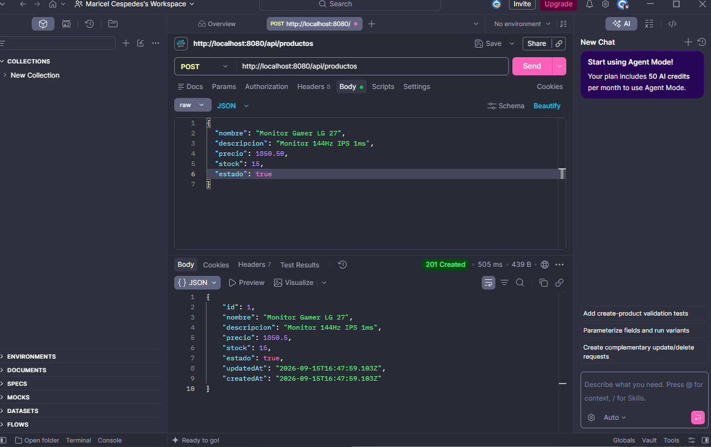
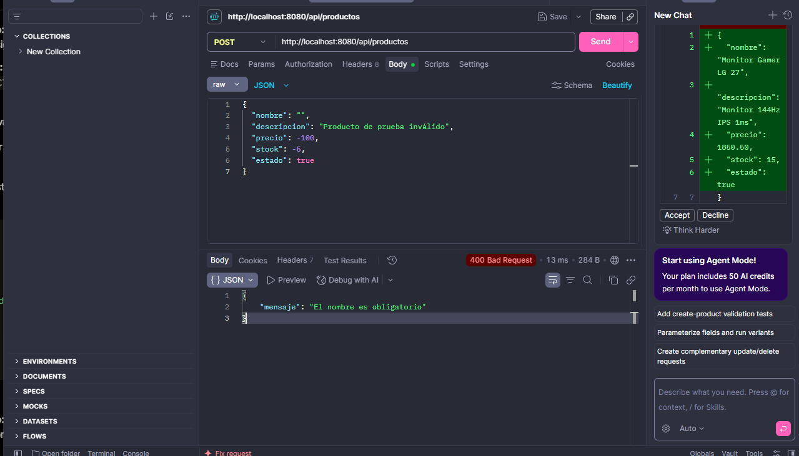
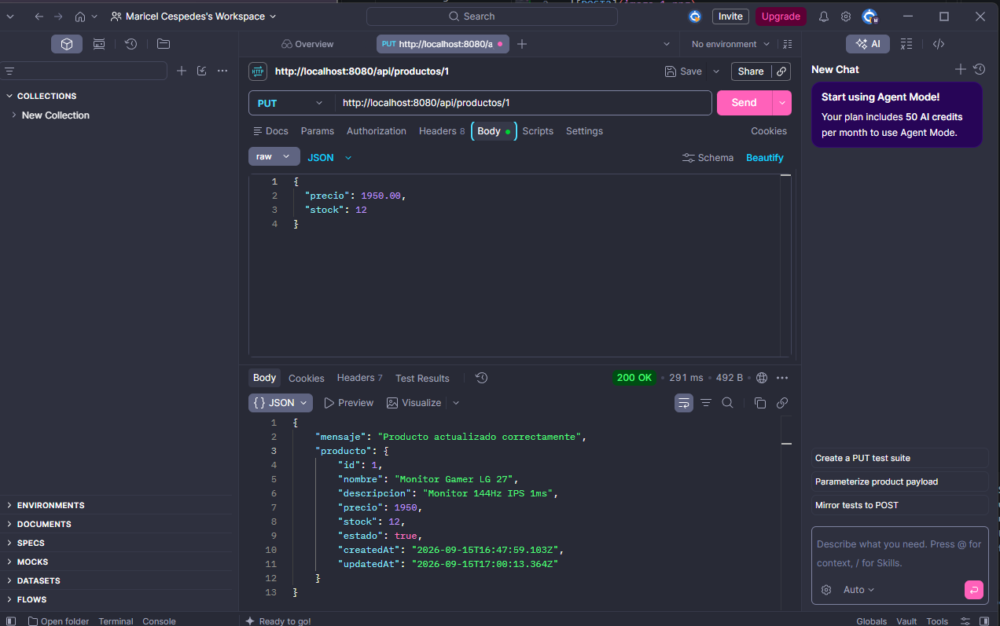
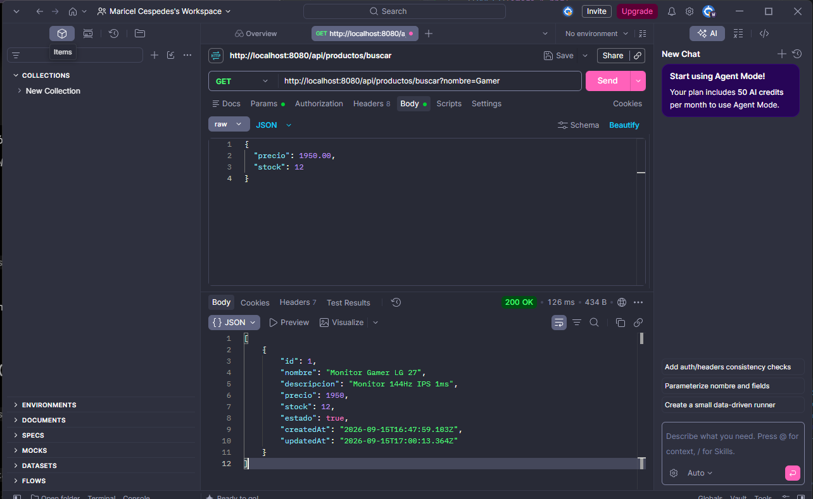
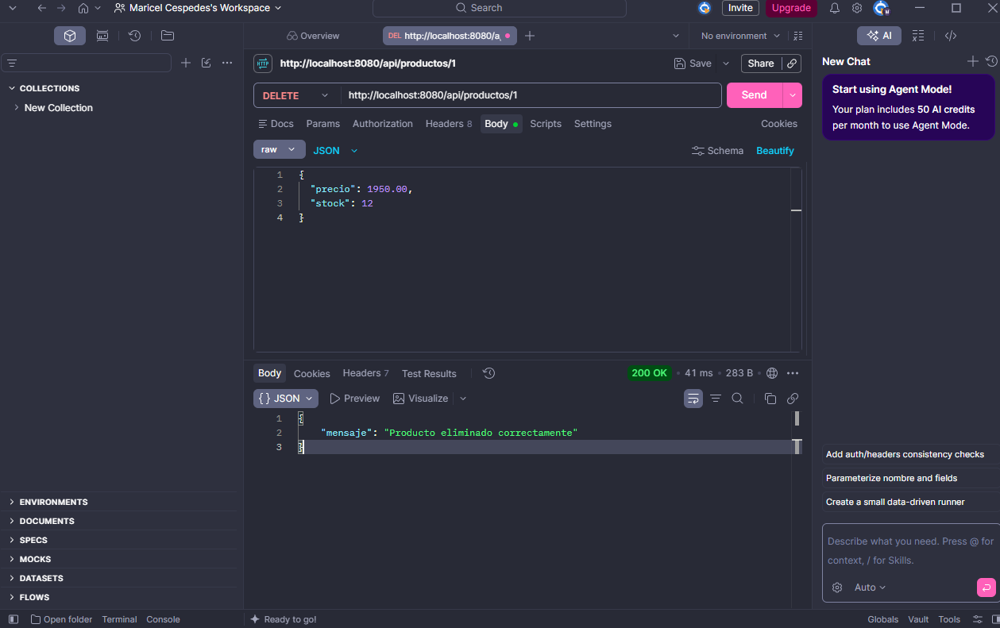
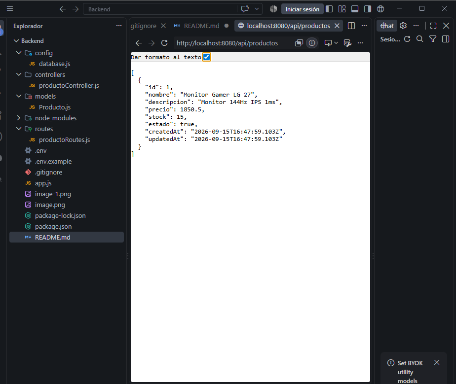
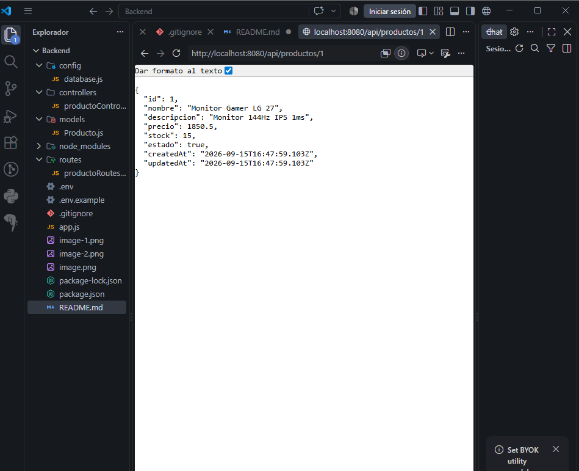
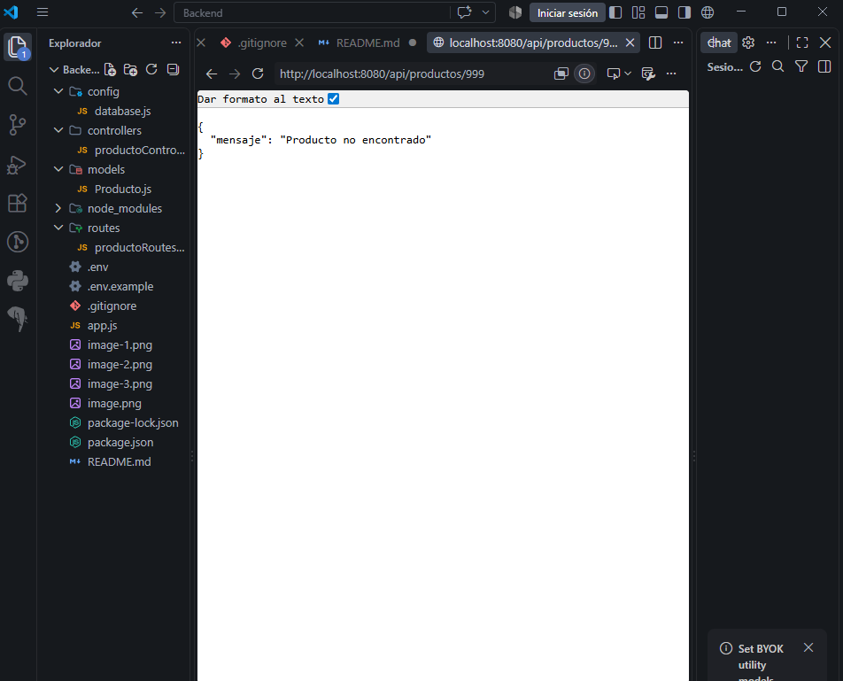
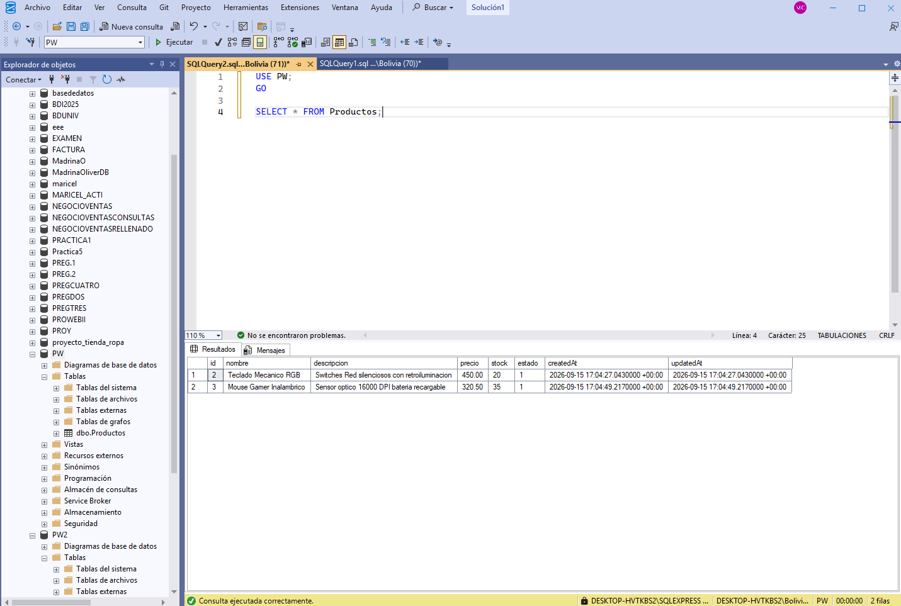

CASO PRACTICO
Desarrolle una API REST para la gestión de productos utilizando Node.js y Express como backend,
Sequelize como ORM y SQL Server como sistema gestor de base de datos. El sistema deberá permitir
registrar, consultar, buscar, actualizar y eliminar productos. Todas las operaciones deberán realizarse
directamente sobre la base de datos SQL Server.
CONDICIÓN FUNDAMENTAL
No se aceptarán arreglos (arrays) locales, datos simulados ni almacenamiento temporal en memoria. La
información mostrada por la API deberá provenir de SQL Server y las operaciones POST, PUT y DELETE deberán
reflejarse realmente en la base de datos.
Estructura mínima del producto
Campo Característica
id Entero, clave primaria y autoincremental
nombre Cadena de texto, obligatorio
descripcion Cadena de texto
precio Decimal, obligatorio y mayor a 0
stock Entero, obligatorio y no negativo
estado Booleano
1. Modelo y conexión a SQL Server
Configure correctamente la conexión entre Node.js y SQL Server mediante Sequelize. El proyecto deberá
mantener una separación organizada de responsabilidades.
backend/
├── config/
│ └── database.js
├── controllers/
│ └── productoController.js
├── models/
│ └── Producto.js
├── routes/
│ └── productoRoutes.js
├── .env
├── .env.example
├── .gitignore
├── app.js
├── package.json
└── README.md

